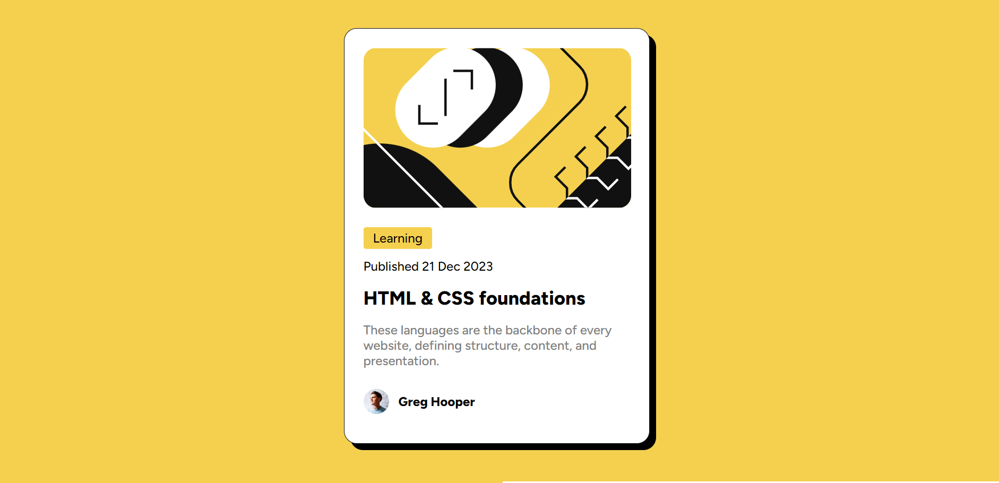
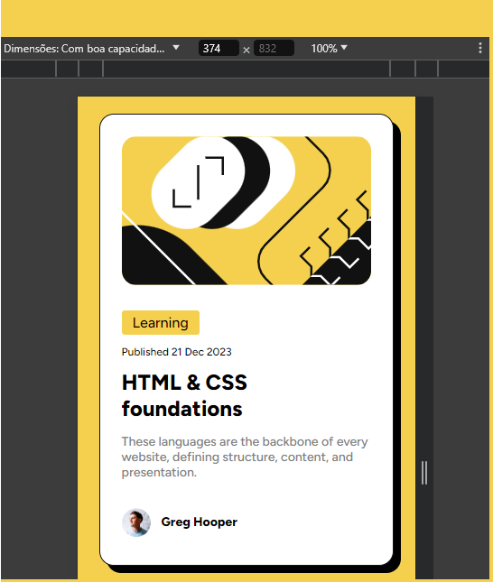

# Frontend Mentor - Blog preview card solution

This is a solution to the [Blog preview card challenge on Frontend Mentor](https://www.frontendmentor.io/challenges/blog-preview-card-ckPaj01IcS). Frontend Mentor challenges help you improve your coding skills by building realistic projects. 

## Table of contents

- [Overview](#overview)
  - [The challenge](#the-challenge)
  - [Screenshot](#screenshot)
  - [Links](#links)
- [My process](#my-process)
  - [Built with](#built-with)
  - [What I learned](#what-i-learned)
  - [Continued development](#continued-development)
  - [Useful resources](#useful-resources)
- [Author](#author)


**Note: Delete this note and update the table of contents based on what sections you keep.**

## Overview

### The challenge

Users should be able to:

- See hover and focus states for all interactive elements on the page

### Screenshots





### Links

- Solution URL: [Add solution URL here](https://your-solution-url.com)
- Live Site URL: [Add live site URL here](https://your-live-site-url.com)

## My process

### Built with

- Semantic HTML5 markup
- CSS custom properties
- Flexbox
- Mobile-first workflow


### What I learned

The challenge helped me reinforce my knowledge of: fonts, boxmodel and media querys. 


```css
.proud-of-this-css {
  font-family: "Figtree", sans-serif;
  font-optical-sizing: auto;
  font-weight: 800;
  font-style: normal;
  font-size: 24px;
}
```


## Author


- Frontend Mentor - [@marciodaniloms](https://www.frontendmentor.io/profile/marciodaniloms)
- Twitter - [@marciodaniloms](https://www.twitter.com/marciodaniloms)


